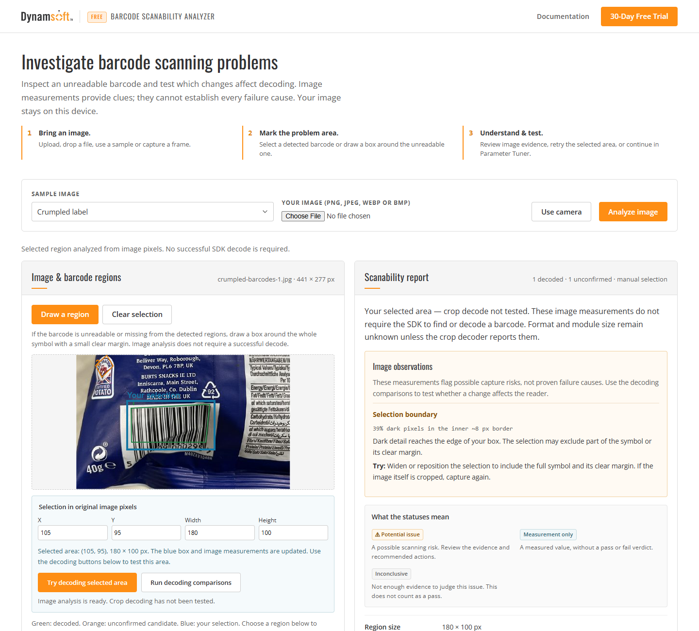

# Barcode Scanability Analyzer

Investigate barcode scanning problems in your browser. Upload an image, mark the
barcode that will not scan, inspect its image characteristics, and compare how
simple image changes affect decoding with Dynamsoft Barcode Reader.

**[Try the online demo](https://www.dynamsoft.com/codepool/demos/barcode-scanability-analyzer/)**



## What you can do

- **Inspect an unreadable barcode.** Draw a box around its location even when the
  reader cannot detect or decode it. Image measurements work independently of decoding.
- **Review image evidence.** Examine contrast, brightness, edge transitions and
  selection boundaries, with explanations and suggested next steps.
- **Compare decoding results.** Test the original selected area, inverted colors,
  stretched grayscale range, a 90-degree rotation and 2× enlargement. Each test
  shows its image, decoded content and processing time.
- **Tune the reader.** Open the same image in the included Parameter Tuner to explore
  barcode formats, binarization, localization and other reader settings.
- **Save your findings.** Export a JSON report with measurements, selection coordinates
  and decoding outcomes.

The example accepts uploaded or dropped images, camera snapshots and bundled sample
photos. It uses plain HTML, CSS and JavaScript, with no build step.

## Run locally

From the repository root:

```bash
cd examples/barcode-scanability-analyzer
python -m http.server 4180
```

Open **http://localhost:4180/** in a modern browser. Serve the entire directory so
that the included samples and Parameter Tuner remain available.

Barcode decoding uses **Dynamsoft Barcode Reader 11.6.3200**, loaded from a CDN.
The online demo uses its hosted demo license; local previews use the SDK's public
trial key. For your own application, obtain a
[trial license](https://www.dynamsoft.com/customer/license/trialLicense/?product=dcv&package=cross-platform)
and set it in the browser console, then reload:

```javascript
localStorage.setItem('dy-demo-license', 'YOUR_LICENSE_KEY');
```

SDK loading and license activation need an internet connection. Camera access and
online license activation require HTTPS or localhost.

## Use the analyzer

1. Upload an image, choose a sample or capture a camera frame.
2. Select a detected barcode, or click **Draw a region** and include the whole
   unreadable symbol with a small clear margin. Drawing updates the report immediately;
   coordinate edits update it when you leave a field or press Enter.
3. Review the observations, then use **Try decoding selected area** or
   **Run decoding comparisons** to check whether a change helps.
4. Confirm any decoded text, export the report, or continue in **Parameter Tuner**.

## Reading the results

**Potential issue** flags a possible scanning risk. **Measurement only** reports a
value without a pass/fail verdict. **Inconclusive** means the image does not provide
enough evidence for that measurement.

These observations and experiments provide clues, not a guaranteed explanation of
failure or an ISO barcode verification grade. The tool does not automatically
diagnose damage, glare or motion blur. A successful transformation shows that the
reader's outcome changed; it does not prove a physical cause.

Images are processed locally in the browser. This example contains no analytics
or tracking scripts. The SDK still downloads its engine and contacts Dynamsoft for
license activation.
